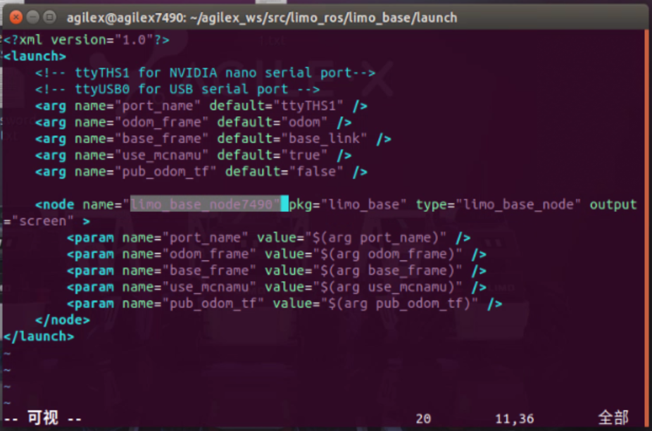

# README

## 项目结构

- 【XING_Python_SDK&Demo】2.4.0.3142 
  - NOKOV官方提供SDK demo，内附whl依赖和说明，按照要求安装运行即可
- LIMO用户手册.pdf
  - limo小车手册，其中注意如何调节遥控器使得小车是**麦克纳姆模式**
  - 建议看附录2，3，4 ros相关
  - 1.9 远程桌⾯连接，使用**NoMachine**远程连接小车
- xing_merge.py
  - 获取SDK数据、控制小车文件，需要提前安装上面提到的whl依赖
- demo.py
  - 控制小车demo，在其中修改小车名字，即可控制小车移动

## 整体框架

使用NOKOV动捕设备获取相关参数，使用Ubuntu18.04安装ROS1控制小车并接收SDK数据

Ubuntu18.04作为ros master，各个小车作为client进行交互

NOKOV，Ubuntu18.04，limo小车需在同一网段下，实验室已保证，**只需Ubuntu和小车都连接到epuck wifi即可**

## 相关细节

### ROS1安装

[小鱼的一键安装系列 | 鱼香ROS (fishros.org.cn)](https://fishros.org.cn/forum/topic/20/小鱼的一键安装系列)

### wsl控制相关

#### 关闭防火墙

**Ubuntu18.04一定要关闭防火墙**，终端中执行

```
sudo ufw disable
```

之后根据ip互相ping进行测试

### limo小车系统

用户名：agilex

登录密码：agx


### 修改limo车名

> 在limo小车ubuntu上操作，由于limo小车在出厂时将小车名都设置为/cmd_vel，在多车控制的情况下，需要修改小车名

1. 打开limo_driver.cpp文件，路径在：

```
/home/agilex/agilex_ws/src/limo_ros/limo_base/src
```

找到文件中的**motion_cmd_sub_**，修改后面的"/cmd_vel"改为"/xxxx"，xxxx为自己设置的名字，即下图高亮部分，建议修改为类似`/cmd_vel7490`，7490为limo小车编号


2. 回到agilex_ws文件夹，进行编译

```
cd ~/agilex_ws
catkin_make
```

3. 重新启动小车ros master

```
roslaunch limo_base limo_base.launch
```

如果之前开启了ros master，必须关闭后重启才能使用修改后的名字进行控制。

### 修改limo ros节点名

> 由于limo小车在出厂前都是设置的相同的ros节点名，在多车控制情况下，需要把小车的ros节点名进行修改

打开limo_base.launch文件，路径在：

```
/home/agilex/agilex_ws/src/limo_ros/limo_base/launch
```
修改图中高亮部分，出厂默认设置是limo_base_node，修改为类似`limo_base_node7490`，7490是小车编号，修改完保存即可。



### 修改limo系统hostname

> 多车连接需要将不同小车的hostname区分开，否则无法控制

1. 在终端运行：
```
sudo hostnamectl set-hostname xxx
```
系统默认的hostname为agilex，xxx为待修改的hostname，可以设置为类似`agilex7490`，7490为小车编号。

2. 在终端运行：

```
sudo getdit /etc/hosts
```

127.0.1.1后对应的hostname原本为agilex，修改为待修改的hostname保存即可，类似这里的`agilex7490`。


### limo端开启底盘

> 在limo小车ubuntu上操作

终端中运行

```
roslaunch limo_base limo_base.launch
```

即可完成设置

## 多车连接

在该环境的多车连接中，我把ubuntu18.04设置为master端，将limos设置为各个client端。

### 准备工作

在多车连接前，需要对**每一个**limo小车都进行**修改limo车名**，**修改limo ros节点名**，**修改limo系统hostname**，一定要设置，具体细节参照前一部分。

### 连接细节

ROS是一个分布式系统框架，因此有必要介绍一下分布式多机通信的设置方法。分布式一般都是主从（master/slave）方式，因此需要两端都要进行设置。

作为示例的四台机器如下：

- master: 192.168.1.100
- client: 192.168.1.200
- client1：192.168.1.201
- client2：192.168.1.202

master及client分别为各自的hostname, 想要查询自己的hostname也非常简单，就使用hostname命令。

#### Master端设置

- 修改hosts文件

```bash
sudo gedit /etc/hosts
```

添加各个client的ip和hostname：

```text
192.168.1.200 client
192.168.1.201 client1
192.168.1.202 client2
……
```

- 设置环境变量ROS_MASTER_URI

```bash
sudo gedit ~/.bashrc
```

添加

```text
export ROS_MASTER_URI=http://192.168.1.100:11311 #注意是master的ip
```

接下来在家目录终端中输入

```
source ~/.bashrc
```

#### Client端设置

- 对于**每个client**修改hosts文件，方法与master相同

添加master端的ip和hostname

```text
192.168.1.100 master
```

- 设置环境变量ROS_MASTER_URI

```bash
sudo gedit ~/.bashrc
```

添加

```text
export ROS_MASTER_URI=http://192.168.1.100:11311 #注意是master的ip
```

接下来在家目录终端中输入

```
source ~/.bashrc
```

#### 测试

在master上打开roscore, 并发送一条消息

```bash
$ rostopic pub /test_topic std_msgs/String "connected"
```

在client上看是否能收到消息

```bash
$ rostopic echo /test_topic
data: "connected"
---
```

### 开始控制

#### 启动ros master

在master，即本项目中的Ubuntu18.04中运行roscore，终端中输入roscore即可启动

#### 启动车底盘

对于**每个limo小车**执行以下指令开启底盘，即可开始控制

```
roslaunch limo_base limo_base.launch
```

#### 测试

修改项目中demo.py中的小车名，运行该文件看小车是否可以移动

#### 查看设备

在master的终端中输入：

```
rostopic list
```

可以看到类似/cmd_vel7490的项出现，以/cmd_vel开头的项就是小车设备名


#### 查看ros节点

在master的终端中输入：

```
rosnode list
```

可以看到类似/limo_base_node7490的项出现，这就是刚才修改的ros节点名


## 常见问题

1. 请用ctrl+C关闭roscore以及小车底盘，使用ctrl+D会使后台挂起，进程没有被kill，可能会导致下一次的启动出问题，如果出问题，关闭所有终端重新启动即可。
2. 有可能前一天可以成功运行并调用小车，但是第二天不行了，请检查master端的/etc/hosts文件中是否还有各个client的ip和hostname，重新添加并且重启各个节点即可。